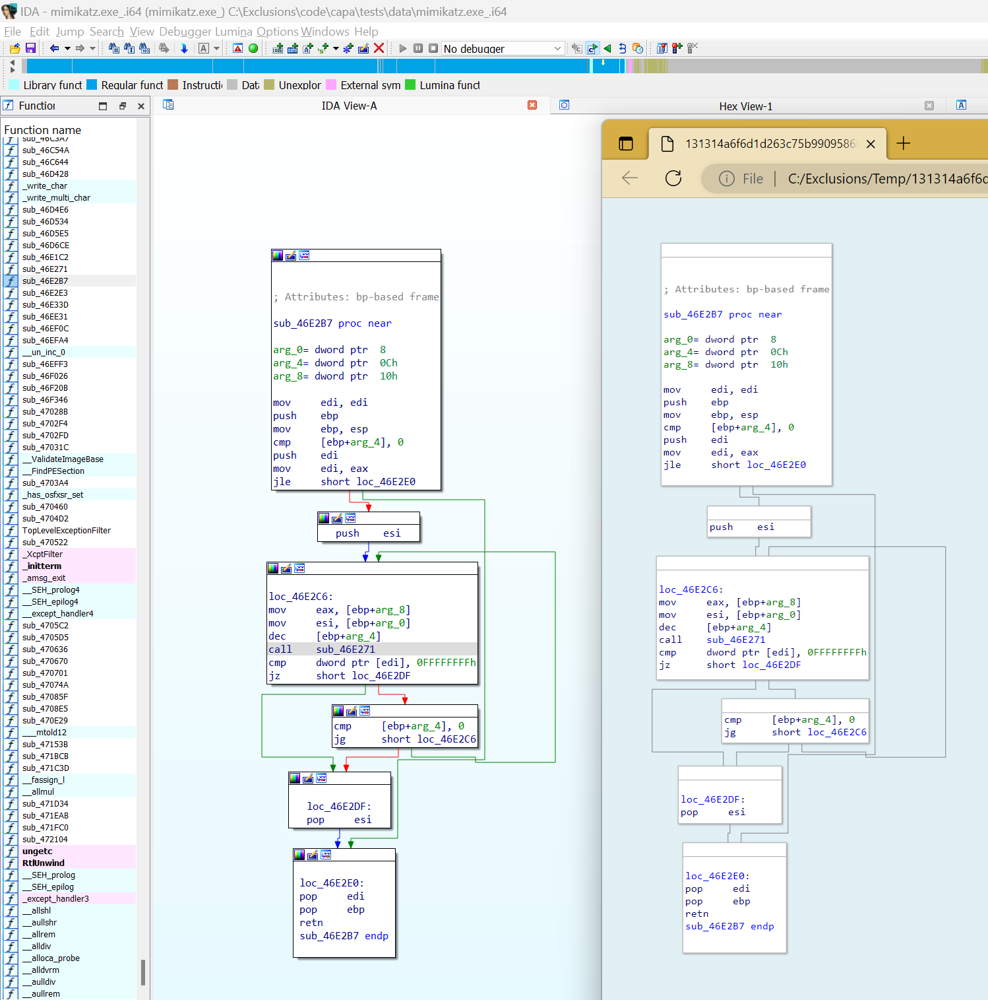

# IDA Graph Exporter (IDAPython, HTML variant)

## What?

An IDAPython script for IDA PRo that allows to export a function as rendered in the graph view to an interactive HTML page.
The pure Python plugin retrieves relevant information from the currently focused graph view and embeds them into the page.
The HTML page can then be loaded into a web browser to be rendered.

This project is derived from the [IDA Graph Exporter](https://github.com/kirschju/ida-graph-exporter) plugin by Julian Kirsch.
The primary differences are: IDAPython versus native plugin, and HTML versus SVG output.
Note, that project has a more thorough and complete handling of theming and fonts.

## How?

Run the script "export_ida_graph.py" from IDA Pro and select the output path for the HTML file.
Then, open this file in a web browser, optionally hosting it on a web server.

Unfortunately, the output file is not fully self-contained: this is an artifact of using ES6 modules to load preact and htm to help with rendering.
Therefore, you're not able to view the exported document on an offline machine, such as a malware analysis VM.
A better solution is to emit a file with all the resources embedded within it; I haven't been able to do this yet.

## Example

Here is the IDA Pro graph view side-by-side with the exported graph rendered by MS Edge:

Note that the rendering is not perfect. Here are the things I'm aware of:

  - a bunch of colored items, due to suspected bug in IDAPython:
    - line background colors
    - node background colors
    - edge colors
  - edges don't have arrows
  - font is `monospace`, not exported from IDA
  - graph background/image
